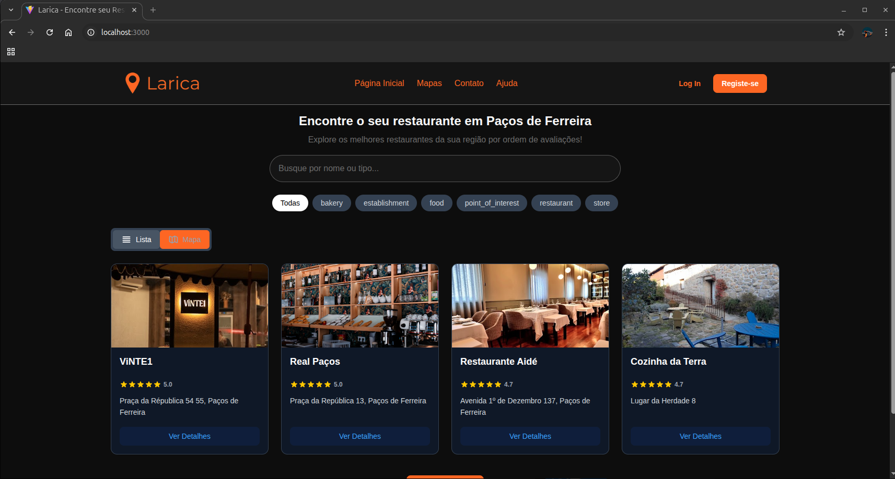

# 🍔 Larica

> Aplicação web moderna para descoberta de restaurantes próximos com mapas interativos e informações em tempo real.


---

## 📸 Preview

<div align="center">
  
</div>

---

## 📋 Sobre o Projeto

**Larica** é uma aplicação web que facilita a descoberta de restaurantes próximos da sua localização. Com uma interface moderna e intuitiva, permite aos utilizadores:

- 🌟 Visualizar avaliações e classificações
- 📍 Localizar restaurantes num mapa interativo
- 📞 Aceder a informações de contacto
- 🌐 Visitar websites dos estabelecimentos
- 🗺️ Explorar restaurantes num raio de 8 km

---

## 🚀 Tecnologias

### Frontend & UI
- **React** + **TypeScript** - Framework e tipagem estática
- **Vite** - Build tool ultrarrápido
- **Tailwind CSS** - Estilização utilitária
- **Framer Motion** - Animações fluidas
- **React Router** - Navegação SPA

### Estado & Forms
- **Zustand** - Gestão de estado global
- **React Hook Form** + **Zod** - Validação de formulários
- **TanStack Query** - Gestão de dados assíncronos

### Mapas & Geolocalização
- **Leaflet** - Mapas interativos
- **Google Places API** - Dados de estabelecimentos
- **ipapi** - Deteção de localização

### Serviços
- **Firebase Authentication** - Sistema de autenticação
- **API REST própria** - Hospedada no Render
- **React Toastify** - Notificações

---

## 📦 Instalação e Execução

### Pré-requisitos
- **Node.js** (v22 ou superior)

### Método 1: Script Shell (Recomendado para Linux/WSL)

```bash
# 1. Instalar dos2unix (apenas WSL/Linux)
sudo apt install dos2unix

# 2. Dar permissões de execução
sudo chmod +x iniciar.sh

# 3. Converter formato do arquivo
dos2unix iniciar.sh

# 4. Executar
./iniciar.sh
```

### Método 2: Comandos NPM

```bash
# Instalar dependências
npm install

# Executar em modo desenvolvimento
npm run dev
```

A aplicação estará disponível em `http://localhost:5173`

---

## 📁 Estrutura do Projeto

```
src/
├── apis/          # Configurações de APIs externas
├── assets/        # Imagens, ícones e recursos estáticos
├── components/    # Componentes React reutilizáveis
├── data/          # Dados estáticos e configurações
├── hooks/         # Custom React Hooks
├── pages/         # Páginas da aplicação
├── routes/        # Configuração de rotas
├── styles/        # Estilos globais e temas
└── vite.config.ts # Configuração do Vite
```

---

## ✨ Funcionalidades

- ✅ **Pesquisa Inteligente** - Encontre restaurantes num raio de 8 km
- ✅ **Mapa Interativo** - Visualização geoespacial em tempo real
- ✅ **Detalhes Completos** - Avaliações, contactos e horários
- ✅ **Autenticação Segura** - Login com Firebase Authentication
- ✅ **Performance Otimizada** - Cache inteligente com TanStack Query
- ✅ **Design Responsivo** - Interface adaptável a todos os dispositivos
- ✅ **Experiência Fluida** - Navegação SPA sem recarregamentos

---

## 🔗 Links

- **Repositório:** [github.com/miguelPRG/larica](https://github.com/miguelPRG/larica)
- **Demo:** [Em desenvolvimento]

---

## 👨‍💻 Autores

Desenvolvido pelos alunos:
- **Miguel Gonçalves** de número mecanográfico **134647**
- **Roberto Santos** de número mecanográfico **117552**
 
---

## 📄 Licença

Este projeto está sob licença MIT. Veja o arquivo `LICENSE` para mais detalhes.

---
